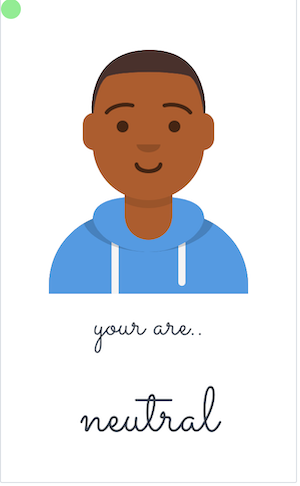

# Avatar-face-expression  

express your feeling through avatars using
[face-api.js](https://github.com/justadudewhohacks/face-api.js?files=1) + [avataaars](https://avataaars.com) 

----------  
## Demo   

 <a href="https://codepen.io/simhub/pen/RwbXzrj?editors=1000"> CODEPEN</a>  

 <a href="https://simhub.github.io/avatar-face-expression/"> GITHUB.IO<a/>  
 

--------------  

 
   

  

